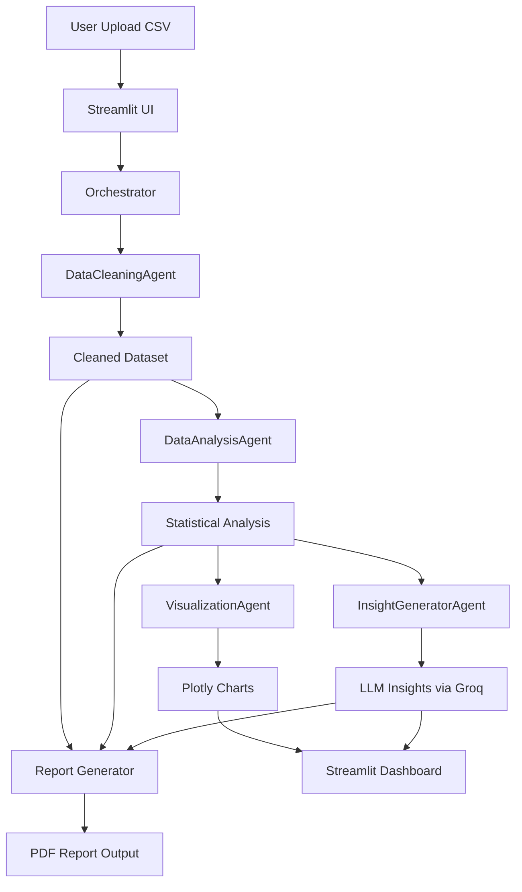

# 🤖 Smart Data Analysis Pipeline - Multi-Agent AI System

An end-to-end **AI-powered data analysis platform** that automatically cleans data, performs statistical analysis, generates visualizations, extracts insights using LLMs (Groq), and exports a professional PDF report — all through a **multi-agent architecture**.


## 🌍 Project Overview

The **Smart Data Analysis Pipeline** is a modular multi-agent system built with Python and Streamlit that transforms raw CSV data into meaningful business insights.

Instead of a single monolithic script, the system uses specialized AI agents:

- 🧹 Data Cleaning Agent
- 📊 Data Analysis Agent
- 📈 Visualization Agent
- 🧠 Insight Generation Agent (Groq LLM)
- 📄 Report Generator Tool

Each agent handles a specific stage of the pipeline, making the system scalable, explainable, and production-ready.


## ⚙️ Tech Stack

- Python 3.13
- Streamlit (UI Dashboard)
- Pandas & NumPy
- Plotly (Interactive Visualizations)
- LangChain + Groq (LLM Insights)
- FPDF (PDF Report Generation)
- dotenv (Environment Management)


## 🧠 Multi-Agent Architecture

| Agent | Responsibility |
|------|----------------|
| 🧹 DataCleaningAgent | Handles missing values, duplicates, outliers, and type fixes |
| 📊 DataAnalysisAgent | Performs EDA, correlations, grouping, and statistical summaries |
| 📈 VisualizationAgent | Auto-generates charts (histograms, scatter plots, heatmaps, etc.) |
| 🧠 InsightGeneratorAgent | Uses Groq LLM to generate business insights |
| 📄 Report Generator | Builds downloadable PDF reports |


## 🔄 System Workflow



## 📁 Folder Structure

```
data-analyst-multi-agents/
│
├── agents/
│   ├── __init__.py
│   ├── analysis_agent.py
│   ├── cleaning_agent.py
│   ├── insight_agent.py
│   └── visualization_agent.py
├── tools/
│   ├── __init__.py
│   └── report_generator.py
├── app.py
├── orchestrator.py        
├── pyproject.toml
├── uv.lock
├── .env
├── .gitignore
├── .python-version
└── README.md
```

## 🚀 How It Works

1. **Upload Dataset**
   - Upload a CSV file through the Streamlit UI.

2. **Pipeline Orchestration**
   - The `orchestrator.py` triggers the multi-agent workflow automatically.

3. **Data Cleaning**
   - Missing values, duplicates, and inconsistencies are handled.
   - Data is standardized for analysis.

4. **Exploratory Data Analysis (EDA)**
   - Statistical summaries are computed.
   - Correlations and distributions are analyzed.

5. **Visualization**
   - Interactive Plotly charts are generated automatically for insights.

6. **AI-Powered Insights**
   - A Groq-powered LLM generates human-like explanations of patterns and trends.

7. **Report Generation**
   - A structured PDF report is created with insights + visualizations.

8. **Interactive Dashboard**
   - Streamlit displays all results in a clean, interactive interface.

## 🧪 Features

### 🧹 Smart Data Cleaning
- Missing value handling  
- Duplicate removal  
- Outlier detection (IQR method)  
- Column normalization  
- Auto type conversion  

### 📊 Advanced Data Analysis
- Descriptive statistics  
- Correlation analysis  
- Group-by aggregations  
- Pattern detection (skewness, dominance, correlation strength)  

### 📈 Auto Visualization Engine
- Histograms  
- Bar charts  
- Pie charts  
- Scatter plots with regression trendline  
- Correlation heatmaps  
- Box plots  
- Time-series plots  

### 🧠 AI-Powered Insights (Groq LLM)
- Executive summary  
- Key business insights  
- Anomaly detection  
- Actionable recommendations  


### 📄 PDF Report Generator
- Clean structured report  
- Cleaning summary  
- Statistical overview  
- AI insights section  
- Downloadable output  


### 🖥️ UI Preview (Streamlit)

The dashboard includes:
- 📊 Data preview  
- 📈 Interactive charts  
- 🧠 Insight panels  
- 📋 Pipeline metrics  
- 📄 PDF export system  


## 📦 Installation & Setup

```bash
# Clone repository
git clone https://github.com/your-username/smart-data-analysis-pipeline
cd smart-data-analysis-pipeline

# Create virtual environment
uv venv

# Install dependencies
uv pip install -r pyproject.toml

# Add environment variables
cp .env.example .env
```


## 🔑 Required Environment Variables

Create a `.env` file and add:

```env
GROQ_API_KEY=your_api_key_here
```

## ▶️ Run the Application

```bash
streamlit run app.py
```

Then open in your browser:

```
http://localhost:8501
```

## 🧑‍💻 Author

**Name:** Puvanakopis  
**GitHub:** [@puvanakopis](https://github.com/puvanakopis)  
**LinkedIn:** [Puvanakopis](https://www.linkedin.com/in/puvanakopis/)  
**Email:** puvanakopis@gamil.com  

A fully automated AI data analyst system designed to turn raw CSV files into actionable business intelligence in seconds 🚀📊
